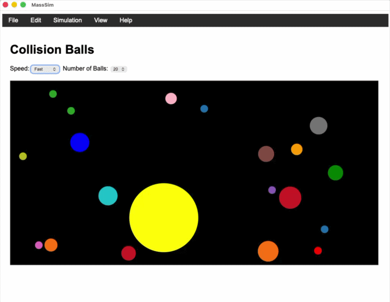

# Mass Simulator
Experiments with forces, mass and gravity.  Using React.js and Saucer to create
a desktop application to view the simulation of collision balls and also 
Particle Lenia.

Collision Balls

Particle Lenia

The Particle Lenia implementation is not exact and requires more work to convert
to this desktop implementation.

## References
[1] Particle Lenia and the Energy Based Formulation, Google Research, Mordvintsev, Niklasson and Randazzo - https://google-research.github.io/self-organising-systems/particle-lenia/
[2] Observable Implementation of Particle Lenia, Mordvintsev, 2023, https://observablehq.com/@znah/particle-lenia-from-scratch